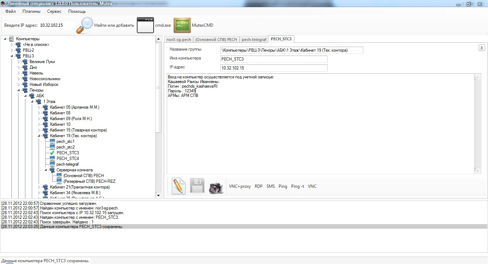

##Главное окно программы

Главная форма программы изображена на Рисунке № 1 и состоит из следующих элементов:

1. [Главное меню](MainMenu.html)
2. Главная панель инструментов
3. Дерево справочника обектов
4. Панель закладок свойств объектов
5. Панель протокола действий
6. Панель статуса

Основными элементами которые наиболее часто используются в работе с данной программой являются: Главная панель инструметов, Дерево справочника.

Справочник компьютеров представлен в виде иерархического дерева. В справочнике может существовать только два вида объектов, это *Группу* и *Компьютер*. *Группа* - это логическое объединение компьютеров для удобства пользователя. В группе могут состоять как компьютеры, так и другие группы, образуя тем самым иерархическое дерево. Все объекты справочника находяться в группе *Компьютеры*. Данная группа не доступна для редактирования пользователю.

При двойном клике мышью по какому либо объекту справочника, в панели вкладок откроется вкладка с свойствами объекта. Если данная вкладка уже окрыта в панели вкладок, то она просто станет активной. При переключении между вкладками, становятся активными соответстующие объекты в дереве справочника. В отрытой вкладке объекта Вы можете изменять его свойства и выполнять команды заданные в свойствах коммандных кнопок.

Основное назначение панели инструметов, это поиск компьютера в справочнику по IP адресу. IP - адрес вводится в поле ввода справа от надписи *Введите IP адрес*. Нажатием кнопки *Найти или добавить*  будет запущен поиск в справочнике по введеному IP. Если такой компьютер в справочнике найден, то вкладка с его свойствами будет открыта на панели вкладок, где можно будет выполнить необходимые комманды нажимая командные кнопки. Если же компьютер не будет найден, то отобразится диалог, с предложением добавить его в группу *<Не в списке>*. В случае согласия, Вы можете позднее переместить компьютер в нужную группу. В случае отказа, Вы можете сами создать компьютер в нужной группе сами.
