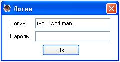

## Запуск программы</b></h2>

**Рисунок № 1**

При запуске программы на экране появляется форма ввода логина и пароля, которая изображена на Рисунке № 1.
В поле ввода "Логин" подставляется логин текущей учётной записи, под которой в данный момент осуществлен вход
в операционную систему, и может быть изменен. В поле "Пароль" необходимо ввести пароль соответственно.
Далее следует нажать кнопку "Ок" или клавишу Enter клавиатуры. После чего откроется главное окно программы.

Следует обратить внимание, что соответствие логина и пароля никак не проверяется. Эти значения запоминаются для последующей, автоматической подстановки в качестве параметров для выполнения команд, для которых они требуются. Например для запуска VNC, логин и пароль нужны для авторизации. Поэтому если значения логин и пароля при запуске были введены не верно, то аутентификация в VNC не будет пройдена. Значения логина и пароля храняться только на время работы программы. При завершения работы программы они никуда не сохраняются и будут утеряны.

[На главную](index.html)