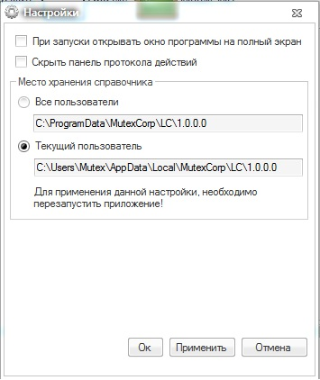

## Параметры программы
На Рисунке № 2 изображено окно настроек приложения.

* **При запуске программы открывать окно на полный экран** - при установленной галочки главное окно приложения будет открываться развёрнутым на весь экран.

* **Скрыть панель протокола действий** - при установке данной галочки будет скрыта панель, в которой отображаются все команды выполняемые программой.

* **Место хранения справочника** - установка данного переключателя изменяет местоположение папки хранения данных приложения. Данные могут храниться либо в папке профиля текущего пользователя, либо храниться в общей папки всех пользователей.

[На главную](index.html)